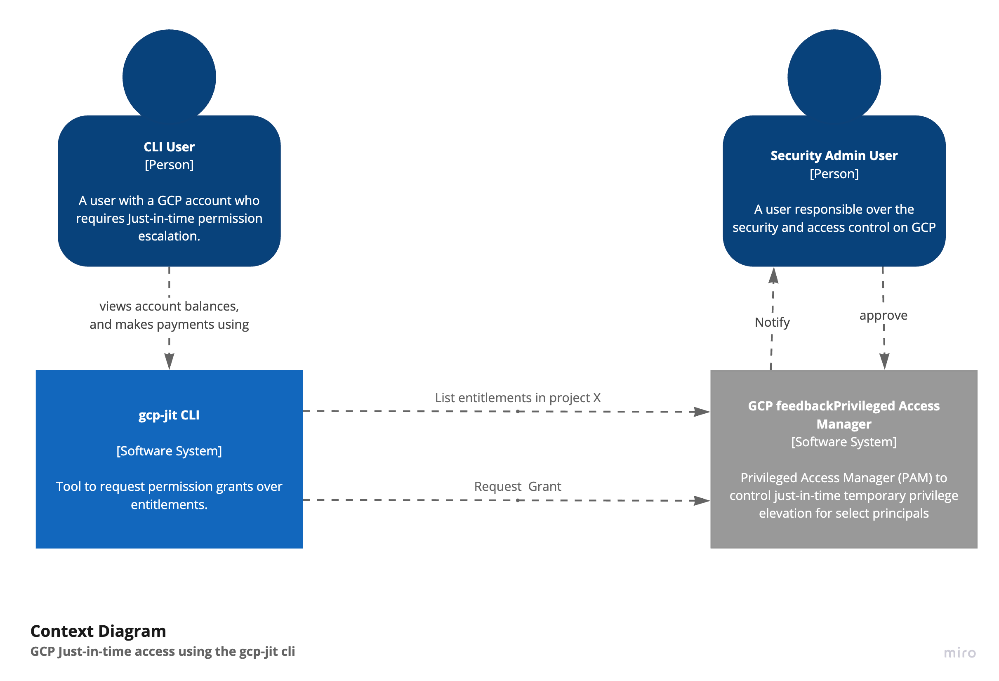

# Just in time access for GCP using PAM




## Introduction

This project is CLI that allows for the employees to request Just-in-time access to GCP resources for a limited time using the
[Google Privileged Access Manager](https://cloud.google.com/iam/docs/pam-overview).

It's composed of two main components:

* A CLI that allows the user to request access to a GCP project
* TODO: A Slack integration that allows the designated approve to be notified and give permission to the user.

## Installation

```
go install github.com/felixgborrego/gpc-pam-jit/cmd/gcp-jit
```

## Usage:

* List the available entitlements:
```shell
gcp-jit entitlements --project prj-xxx-33333
```
Example output:
```shell
Your current GCP user has the following entitlements for the project prj-xxx-33333 and location global:

🛡️ Entitlement: database-access (1h0m0s)
    Granted Roles: roles/alloydb.admin
    No manual approval required

🛡️ Entitlement: gke-access (1h0m0s)
    Granted Roles: roles/gkehub.connect, roles/container.developer
    Approval required by: user:felix@test.com

🛡️ Entitlement: test-2 (1h0m0s)
    Granted Roles: roles/appengine.appAdmin
    Approval required by: user:felix@test.com

````

* Request Just-in-Time access:
```shell
gcp-jit request database-access \
     --project prj-xxx-33333 \
     --justification "I need to run a basic query on the prod database"
````


## Manual build and run

```
go build -o bin/gcp-jit github.com/felixgborrego/gpc-pam-jit/cmd/gcp-jit

```
